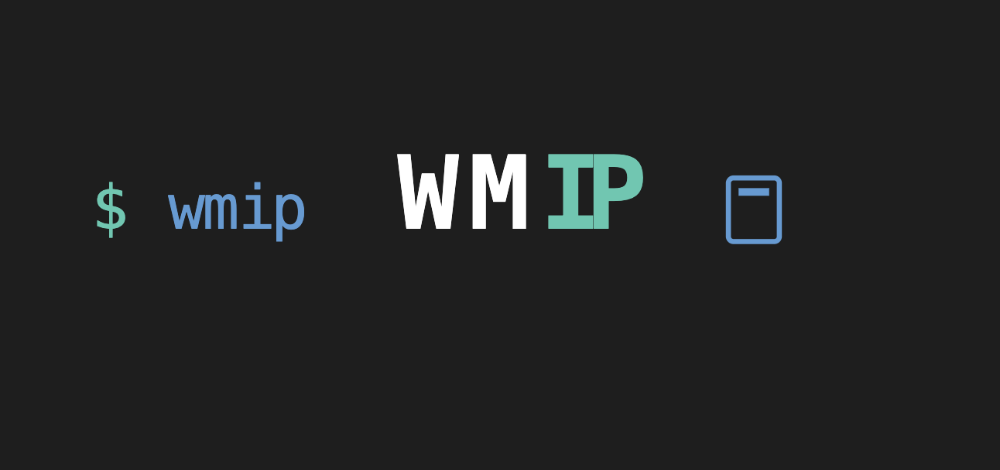

# wmip

<div align="center">
  
  <p><strong>A lightweight CLI tool to fetch your public IP address</strong></p>
</div>

## Overview

`wmip` (What's My IP) is a fast and simple command-line tool that fetches your public IP address and automatically copies it to your clipboard. Built specifically for macOS users, it provides a convenient way to quickly get your public IP address.

## Features

- 🚀 Fast and lightweight
- 📋 Automatic clipboard copying
- 🔄 Real-time IP address fetching
- 💻 Native macOS support

## Installation

### Using Homebrew (Recommended)
```
brew install wmip
```
### Using Makefile

Alternatively, you can build and install wmip from source using the Makefile. First, clone the repository:

```
git clone https://github.com/tolgayakar/wmip.git
cd wmip
```

Then, run the following commands:


> - Build the application:
```
make build
```
> - Install the application:
```
make install

```
## Usage

After installation, you can run wmip to fetch your public IP address and copy it to your clipboard:
```
wmip
```
This will display your public IP in the terminal and automatically copy it to your clipboard for easy use in other applications.
